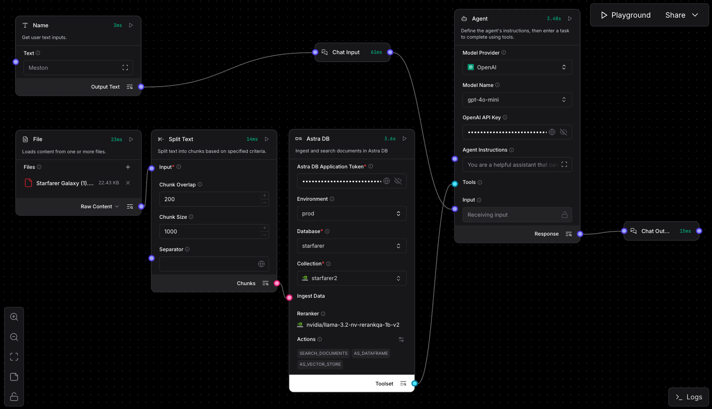
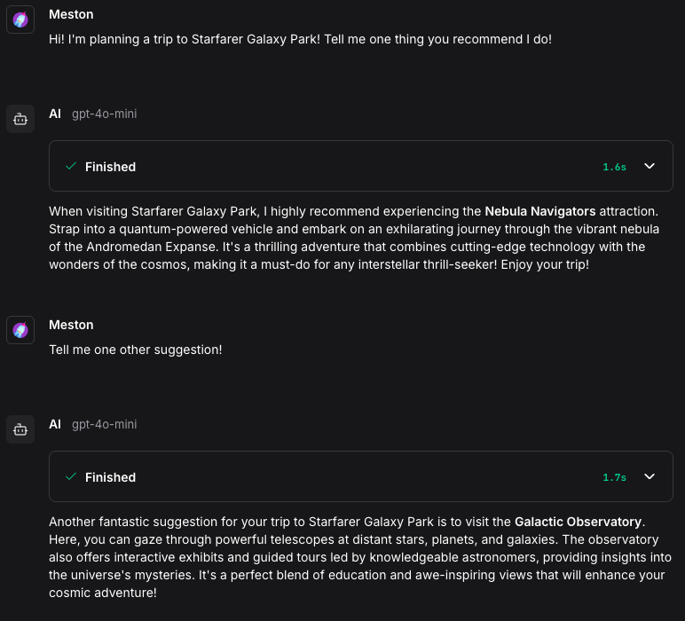
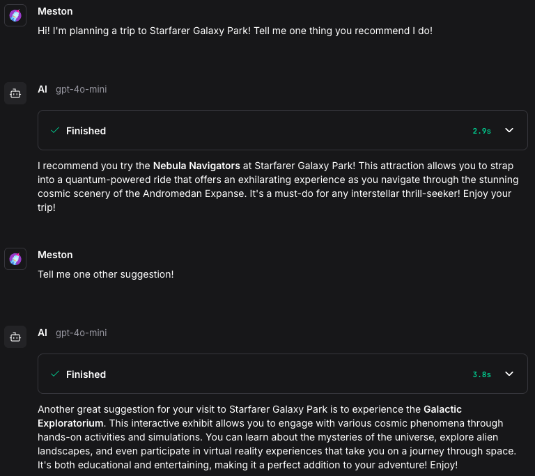
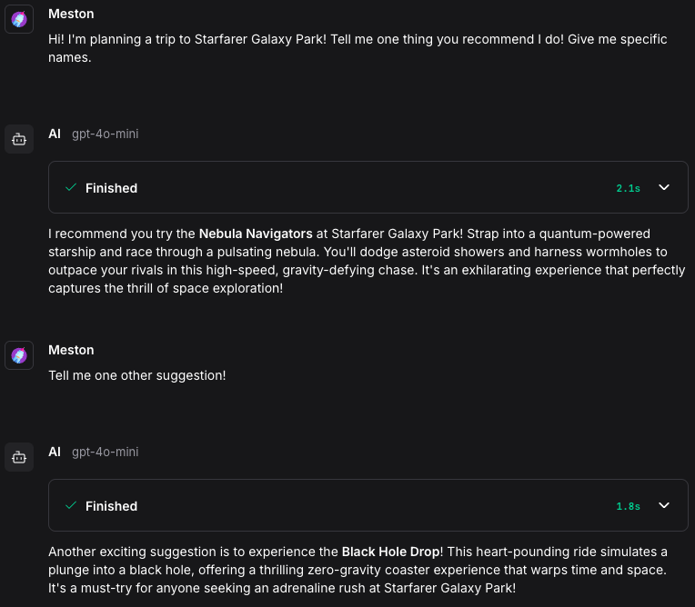

# Langflow Demo: I don't like it

## Objective

The primary goal of this demo was to explore [Langflow](https://docs.langflow.org/), a visual workflow tool for building applications with language models and data pipelines. I aimed to test its usability, setup process, and effectiveness in handling a custom PDF about "Starfarer Galaxy" (generated using Grok) by integrating it with a vector database (Astra DB) and an agent to answer queries. The demo is an experiment, with no specific production use case in mind.

## Conclusion

Conclusion: I wouldn't use it. Can't imagine how it would be beneficial in any production environment.

I wasted a lot of time trying to:
- Configure Pinecone
- Configure Astra DB to work with OpenAI Embedding
- Configure Astra DB to get the top n matches from the database

But all failed. 

It was a cool experience to see an app with a pretty good UI. However, with the landscape changing so fast, elements can become outdated quickly. The widgets inside Langflow have changed significantly from just one year ago. Also, since LLMs work better with plain code, it helps me troubleshoot faster than with an application. The UI layer, which may have been good in the past, is becoming troublesome for machine-readability.

An additional layer on top means it has fewer users than the original material, so there’s less of a community to troubleshoot together. For instance, searching "Langflow Pinecone" yielded one result, https://www.youtube.com/watch?v=b61v8whJIyE&t=72s (other videos used Astra DB), but it didn’t help with troubleshooting at all. It also means that LLMs have a worse chance of being trained in the domain. All of this fuels distrust in the software. Even if it may customizable within the app, which means I should blame myself, I believe the tool might be outdated, so I discredit it.

This is a day and age where directly managing or tweaking code has become very easy. I think it’s really hard to justify a UI layer on top. I don’t like Langflow all that much. Cool? Yes. But will I use it? No. I’d rather wrestle with code in VS Code myself.

Langflow also takes a very long time to download. pip install langflow takes too long. I had to pip install uv first, create a virtual environment with uv venv, and then use uv pip install langflow.

## Setup and Testing Scenarios

The setup below using Astra DB and NV-Embed-QA was the one that worked. Since this is a demo, I'm just going to go with it.

The setup using Pinecone and OpenAI Embeddings didn't work. I'm sure there's no issue with the API key. Maybe it's a compatibility issue, or I haven't tuned the OpenAI Embedding model properly.

*Screenshot**: Langflow workflow canvas showing the node connections.

### Agent Instructions

Agent Instructions were important in getting the Agent to use the tool. Two types of instructions were tested:

- **Agent Instruction Type 1**:  
  "You are a helpful assistant that can use tools to answer questions and perform tasks."

- **Agent Instruction Type 2**:  
  "You are a helpful assistant that can use tools to answer questions and perform tasks.
  You are given a pdf about Starfarer Galaxy. The document contains information about Starfarer Galaxy Park, The Galactic Concordium, Stellar Rides Dealership.
  You may access this pdf via tools."

#### Scenario 1: Agent Instruction Type 1, Chunk Size 500
- **Setup**: Used Agent Instruction Type 1 with a chunk size of 500.
- **Outcome**: In this case, the second prompt wouldn't even use the tool. *Galactic Observatory* is not even an entry in the pdf! It made it up.

#### Scenario 2: Agent Instruction Type 2, Chunk Size 500
- **Setup**: Used Agent Instruction Type 2 with a chunk size of 500.
- **Outcome**: The agent utilized the `search_document` tool, executing it with the following queries: 
  - `"search_query": "Starfarer Galaxy Park attractions"`
  - `"search_query": "Starfarer Galaxy Park activities"`
  - `"search_query": "Starfarer Galaxy Park activities recommendations"`

  Each query returned the top 4 matches (12 matches total). However, all matches pointed to the same text snippet:

  "text": "Starfarer Galaxy Park\nA Cosmic Adventure Awaits in a Galaxy Far, Far Away\nWelcome to Starfarer Galaxy Park\nNestled in the vibrant nebula of the Andromedan Expanse, Starfarer Galaxy Park is the ultimate destination for interstellar thrill-seekers and cosmic explorers. Spanning a terraformed asteroid cluster, our park offers unparalleled attractions that blend cutting-edge galactic technology with the wonders of the cosmos.\nSignature Attractions\n• Nebula Navigators: Strap into a quantum-powered..."

  This limited context led to the agent generating *Galactic Exploratorium*, another non-existent entry in the PDF.

#### Scenario 3: Agent Instruction Type 2, Chunk Size 1000
- **Setup**: Used Agent Instruction Type 2 with a chunk size of 1000.
- **Outcome**: Increasing the chunk size to 1000 did not resolve the issue of retrieving the top match multiple times instead of diverse top-n matches. However, the larger chunk size provided enough context to include *Black Hole Drop*, an actual entry in the PDF.

